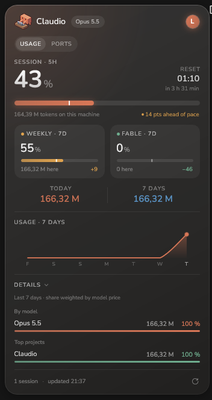

<div align="center">

# ✳︎ Claudio

**Tes vrais quotas Claude, sur ton bureau Windows.**

[](https://github.com/Endikk/Claudio/releases)
[](https://github.com/Endikk/Claudio/stargazers)
[](https://github.com/Endikk/Claudio/releases)
[](https://www.microsoft.com/fr-fr/windows)
[](LICENSE)

🇬🇧 [Read this README in English](README.md)

<p align="center"></p>

<p align="center"></p>

</div>

Un widget Windows flottant pour ton usage de Claude, le jumeau de [Claudy](https://github.com/Endikk/Claudy)
sur macOS. Sans bordure, toujours au-dessus, déplaçable, en mode compact ou complet. Les jauges
affichent les **vrais quotas** du compte — les mêmes chiffres que claude.ai ▸ Usage et `/usage` —
tandis que le détail des tokens vient des transcripts locaux de Claude Code, sous Windows et dans WSL.

- **Des chiffres réels, ou aucun.** Les pourcentages viennent de la seule API d'Anthropic. Quand
  elle ne dit rien, les jauges affichent « — » plutôt qu'une estimation. Sur un PC sans Claude Code
  où personne n'est connecté, un jeu d'exemple marqué « demo » montre à quoi ressemble Claudio.
- **Onglet Ports.** Liste les ports TCP laissés en écoute par Claude Code, sessions orphelines
  comprises, et les ferme d'un clic. L'attribution lit les marqueurs Claude hérités dans
  l'environnement du process : rien d'autre sur le PC n'est listé.
- **Rien ne sort du PC.** Pas de télémétrie, pas de serveur tiers, aucune conversation lue ni
  envoyée. Les seules requêtes réseau vont à l'API d'Anthropic.

## Installer

```powershell
scoop bucket add claudio https://github.com/Endikk/scoop-claudio
scoop install claudio
```

<details>
<summary>Autres voies</summary>

**Installeur :** télécharge `Claudio-win-x64-Setup.exe` (ou `win-arm64`) depuis les
[releases](https://github.com/Endikk/Claudio/releases) et lance-le. Claudio s'installe pour toi
seul, sans droits administrateur, pose son icône sur le Bureau et dans le menu Démarrer, puis se
met à jour tout seul.

Claudio **n'est pas encore signé** : SmartScreen peut prévenir au premier lancement
(*Informations complémentaires* ▸ *Exécuter quand même*). Tu préfères éviter ? Compile-le
toi-même ci-dessous ; le code est court et vérifiable.

**Depuis les sources (Windows 11, SDK .NET 10) :**

```powershell
git clone https://github.com/Endikk/Claudio.git
cd Claudio
dotnet publish src/Claudio.App -c Release -p:Platform=x64 -r win-x64 -o publish
.\publish\Claudio.exe
```

winget (`winget install Endikk.Claudio`) arrive avec la 1.0.0.

</details>

## Utiliser

Claudio n'a pas de fenêtre dans la barre des tâches. Il s'affiche en carte flottante au-dessus de
l'horloge ; dans la zone de notification, la mascotte et, à côté, le chiffre principal (« 42% »),
où un clic ouvre une carte courte ; ou en îlot suspendu en haut de l'écran, la mascotte et le
chiffre de part et d'autre, qui s'ouvre au survol comme celui de Claudy autour de l'encoche. Un
clic droit sur l'un d'eux le déplace.

| Geste | Effet |
|---|---|
| Glisser la carte | Déplacer le widget |
| Clic sur la session ou sur la bande minimale | Passer du mode complet au mode minimal |
| `usage` / `ports` | Basculer entre les quotas et les ports laissés ouverts par Claude |
| Clic droit | Rafraîchir · Mode · Emplacement (carte, zone de notification, haut de l'écran) · Connexion · Toujours au-dessus · Lancer au démarrage · Quitter |
| Survol de l'îlot en haut de l'écran | Ouvrir la session, son rythme et sa remise à zéro, et les autres quotas |
| Clic sur l'icône près de l'horloge | Afficher ou masquer la carte, ouvrir la carte courte, ou ouvrir l'îlot |
| Clic sur l'avatar | Carte du compte |
| Clic sur « Details » | Répartition par modèle et projets principaux |
| Ctrl+R ou F5 | Rafraîchir |
| Ctrl+Q | Quitter |

Rafraîchit toutes les 3 minutes, et aussitôt au réveil du PC.

## Documentation

La documentation détaillée est en anglais :

- [How it works](docs/how-it-works.md) — sources des données, invariants des quotas, relais de la
  status line, marqueur de rythme, l'îlot, mode démo, confidentialité.
- [Development](docs/development.md) — compilation, tests, structure du projet, les contraintes de
  la fenêtre à connaître avant d'y toucher.
- [Architecture](docs/architecture.md) — comment Claudio suit Claudy, fichier pour fichier.

## Branches

| Branche | Rôle |
|---|---|
| `main` | Stable. Ce qui est publié et ce que Scoop installe. |
| `develop` | La branche mobile. Chaque fonctionnalité y arrive d'abord et y reste tant qu'elle n'a pas servi pour de vrai ; `main` ne reçoit que ce qui a tenu. |

Ouvre tes pull requests sur `develop`.

## Contribuer

Un bug, une idée, un chiffre qui ne correspond pas à claude.ai ? Ouvre une
[issue](https://github.com/Endikk/Claudio/issues) — une capture et
`%LOCALAPPDATA%\Claudio\api.log` sont les bienvenues. Les PR sont ouvertes.

MIT, maintenu par [@Endikk](https://github.com/Endikk).

<p align="center"></p>
